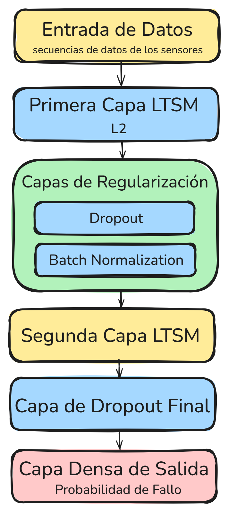
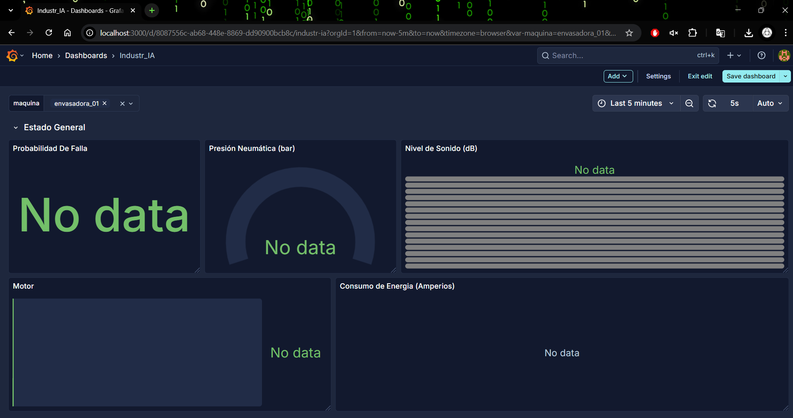
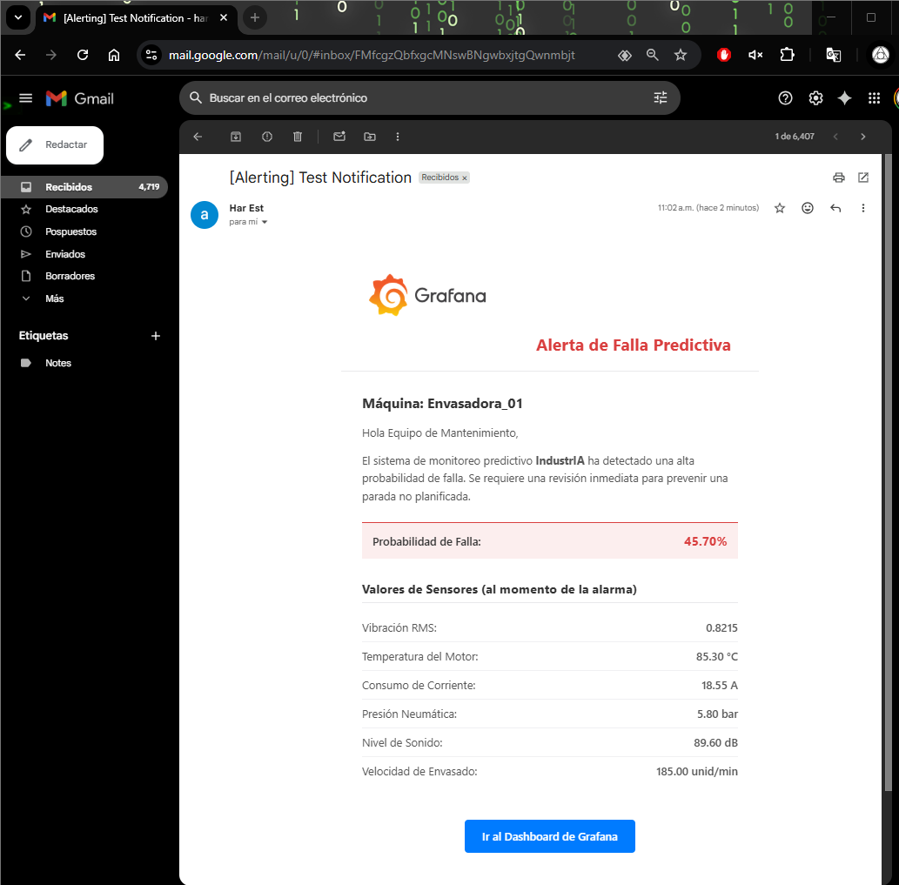

# Industr_IA: Plataforma de Mantenimiento Predictivo para la Industria 4.0

[cite_start]Este proyecto presenta **Industr_IA**, una plataforma integral de mantenimiento predictivo diseñada para anticipar fallos en máquinas industriales hasta con tres días de antelación. [cite: 9] [cite_start]Utilizando un modelo de Deep Learning (LSTM), la plataforma analiza datos de sensores en tiempo real para minimizar las paradas de producción no planificadas y optimizar las operaciones de mantenimiento. [cite: 8, 11]

---

## 🤖 Arquitectura del Modelo LSTM

[cite_start]El núcleo de la plataforma es un modelo de red neuronal recurrente **Long Short-Term Memory (LSTM)** apilado. [cite: 192] [cite_start]Esta arquitectura es ideal para analizar secuencias de datos temporales de múltiples sensores, permitiendo aprender patrones complejos que preceden a un fallo. [cite: 11, 512, 513] [cite_start]El modelo incluye capas de regularización como Dropout y Batch Normalization para evitar el sobreajuste y mejorar la generalización. [cite: 335, 339]

---

## 🏗️ Arquitectura de Infraestructura en AWS

[cite_start]La solución está desplegada en una arquitectura **serverless y orientada a eventos en AWS**, lo que garantiza escalabilidad, flexibilidad y eficiencia en costos. [cite: 230]

1.  [cite_start]**Planta:** Los sensores en la máquina envasadora envían datos a través de un Access Point industrial. [cite: 111, 599]
2.  [cite_start]**Ingesta:** AWS IoT Core recibe los datos de forma segura. [cite: 599]
3.  [cite_start]**Procesamiento:** Una función Lambda procesa y limpia los datos. [cite: 599]
4.  [cite_start]**Almacenamiento:** Los datos se guardan en Amazon Timestream, una base de datos optimizada para series temporales. [cite: 599]
5.  [cite_start]**Inferencia:** Otra función Lambda invoca al modelo en SageMaker para obtener una predicción de fallo. [cite: 599]
6.  [cite_start]**Modelo:** El modelo LSTM está alojado en Amazon SageMaker. [cite: 599]
7.  [cite_start]**Alertas:** Si la probabilidad de fallo es alta, Amazon SNS envía una notificación al equipo de mantenimiento. [cite: 599]
8.  [cite_start]**Visualización:** Grafana se conecta a Timestream para mostrar dashboards en tiempo real. [cite: 232, 599]

---

## 📊 Dashboards de Monitorización en Tiempo Real

[cite_start]Se desarrollaron dashboards en Grafana para visualizar el estado de la maquinaria y las predicciones del modelo en tiempo real, proporcionando inteligencia accionable al personal de planta. [cite: 114, 232]

### Estado Normal
El dashboard muestra una probabilidad de fallo baja y los valores de los sensores dentro de los rangos operativos normales.

### Predicción de Falla
El sistema detecta una anomalía y la probabilidad de fallo aumenta significativamente, alertando sobre un posible problema inminente.

### Máquina Detenida
Cuando la máquina está parada, los sensores no reportan datos, lo cual se refleja inmediatamente en el dashboard.

---

## 🔔 Sistema de Alertas Predictivas

[cite_start]Cuando el modelo predice una alta probabilidad de fallo, el sistema envía automáticamente una **alerta por correo electrónico** al equipo de mantenimiento. [cite: 609] La notificación incluye los valores de los sensores al momento de la alarma para facilitar un diagnóstico rápido.

---

## 🎯 Resultados del Modelo

El modelo predictivo fue evaluado rigurosamente, demostrando una alta efectividad para la detección de fallos:
* [cite_start]**Precisión Global:** 96% [cite: 12]
* [cite_start]**Recall (Sensibilidad):** 99% [cite: 12]

[cite_start]Estos resultados confirman la viabilidad técnica de la solución y su capacidad para minimizar las paradas inesperadas. [cite: 12, 14]
