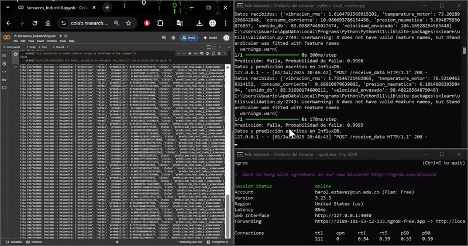
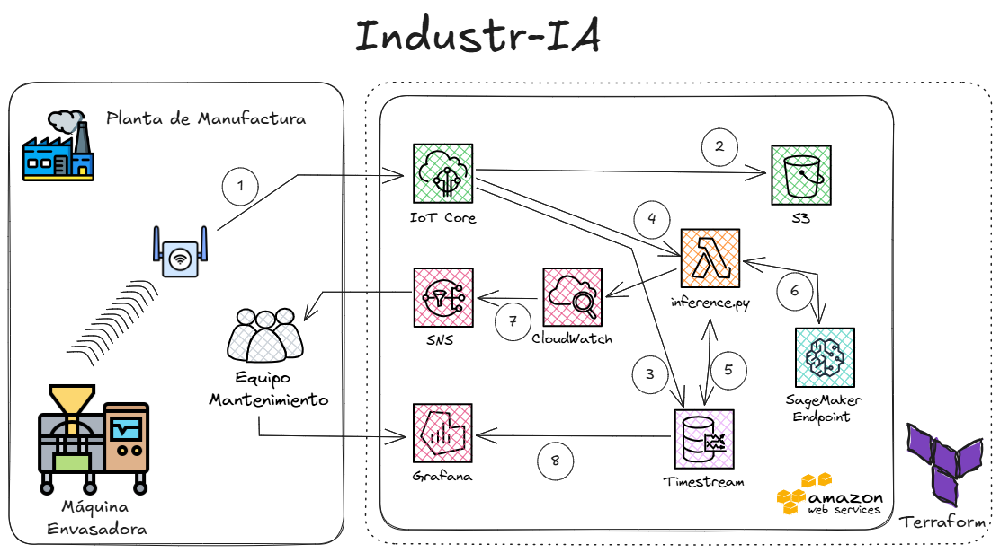
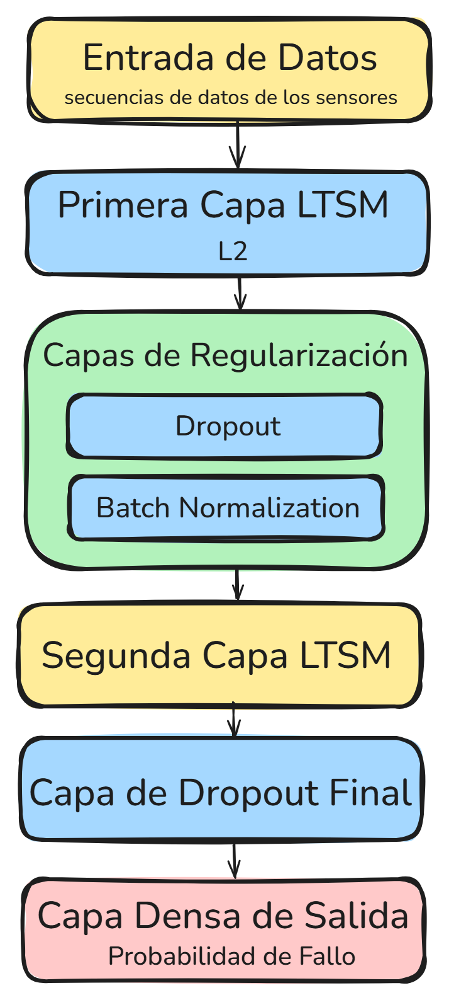
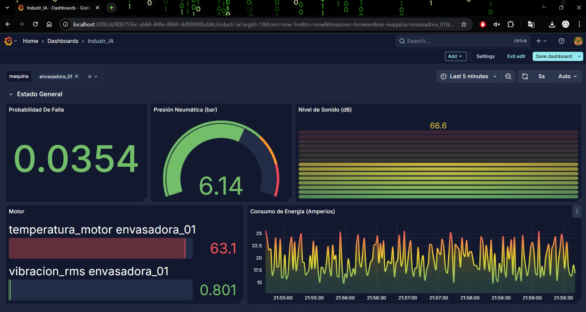
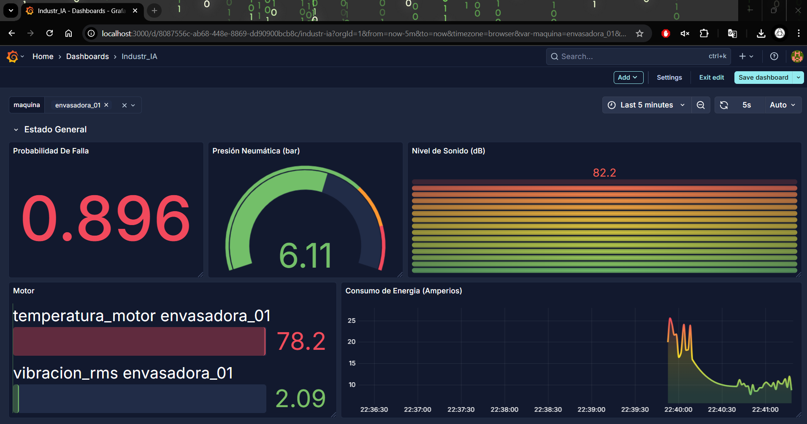
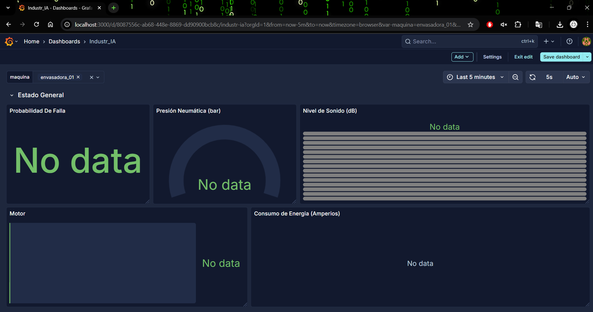
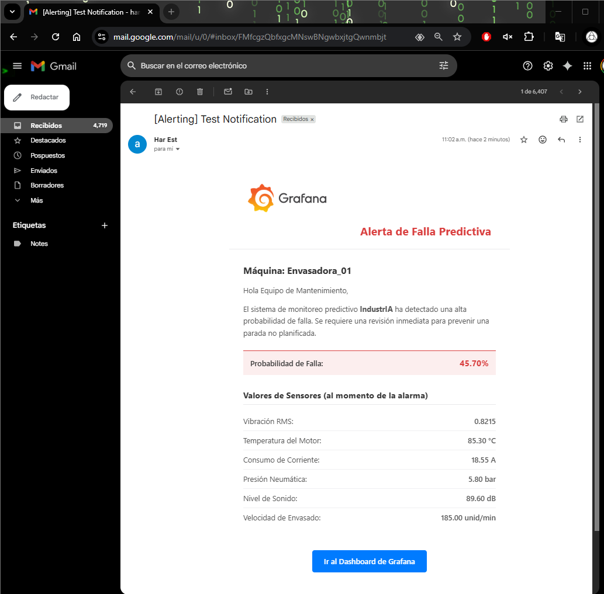

<div align="center">
  <h1>Industr_IA: Plataforma de Mantenimiento Predictivo para la Industria 4.0</h1>
</div>

<p>
Este proyecto, <strong>Industr_IA</strong>, es una plataforma integral de mantenimiento predictivo diseñada para anticipar fallos en máquinas industriales hasta con tres días de antelación. Utilizando un modelo de Deep Learning (LSTM), la plataforma analiza datos de sensores en tiempo real para minimizar las paradas de producción no planificadas y optimizar las operaciones de mantenimiento.
</p>

<p align="center">
  
</p>

---

## 🚀 Tecnologías Utilizadas
*   **Proveedor Cloud:** AWS (Amazon Web Services)
*   **Infraestructura como Código:** Terraform
*   **Modelo de Machine Learning:** Python, TensorFlow (Keras), Scikit-learn
*   **Ingesta y Procesamiento de Datos:** AWS IoT Core, AWS Lambda
*   **Almacenamiento de Datos:** Amazon Timestream, Amazon S3
*   **Despliegue del Modelo:** Amazon SageMaker
*   **Monitorización y Alertas:** Amazon CloudWatch, Amazon SNS
*   **Visualización:** Grafana

---

## 🏗️ Arquitectura de Infraestructura en AWS

La solución está desplegada en una **arquitectura serverless y orientada a eventos en AWS**, lo que garantiza escalabilidad, flexibilidad y eficiencia en costos.

<p align="center">
  
</p>

### Flujo de Datos
1.  **Planta:** Los sensores en la máquina envasadora envían datos a través de un Access Point industrial a un topic MQTT (`topic/maquinas/+`).
2.  **Ingesta:** Una regla de **AWS IoT Core** se suscribe al topic MQTT. Al recibir un mensaje, desencadena múltiples acciones.
3.  **Almacenamiento de Datos Crudos:** El payload JSON crudo se almacena en un bucket de **Amazon S3** para respaldo y análisis futuros.
4.  **Almacenamiento en Series de Tiempo:** Los datos se escriben en una base de datos de **Amazon Timestream**, optimizada para series temporales y que sirve como fuente para los dashboards de Grafana.
5.  **Procesamiento en Tiempo Real:** La regla de IoT invoca una función **AWS Lambda**, pasando los datos del sensor como payload del evento.
6.  **Predicción:** La función Lambda preprocesa los datos usando un `StandardScaler` guardado e invoca un **Endpoint de Amazon SageMaker** para obtener una predicción de fallo.
7.  **Alojamiento del Modelo:** El modelo LSTM está alojado en un Endpoint de SageMaker, que escala automáticamente para manejar las solicitudes de predicción.
8.  **Alertas:** Si el modelo predice una alta probabilidad de fallo (`pre_falla`), la función Lambda publica un mensaje en un topic de **Amazon SNS**, que envía una notificación por correo electrónico al equipo de mantenimiento.
9.  **Manejo de Errores:** Si la regla de IoT Core no puede procesar un mensaje, este se envía a una cola de **Amazon SQS** como Dead-Letter Queue (DLQ) para su inspección posterior.
10. **Visualización:** **Grafana** se conecta directamente a Amazon Timestream para mostrar dashboards en tiempo real del estado de la maquinaria y las predicciones del modelo.

---

## 🤖 Arquitectura del Modelo LSTM

El núcleo de la plataforma es una red neuronal recurrente **Long Short-Term Memory (LSTM)** apilada. Esta arquitectura es ideal para analizar secuencias de datos temporales de múltiples sensores, permitiendo aprender patrones complejos que preceden a un fallo. El modelo incluye capas de regularización como Dropout y Batch Normalization para evitar el sobreajuste y mejorar la generalización.

<p align="center">
  
</p>

---

## 📂 Estructura del Proyecto

```
AIEngennier-Industr_IA/
├── DataSet/
│   └── ds_envasadoras.csv         # Dataset de entrenamiento y validación
├── Img/
│   └── *.png                     # Imágenes y diagramas para la documentación
├── terraform_project_AWS/
│   ├── lambda_function/
│   │   ├── lambda_function.py    # Código Python para la Lambda de inferencia
│   │   └── standard_scaler.save  # Scaler para el preprocesamiento de datos
│   ├── sagemaker_model/
│   │   ├── code/
│   │   │   └── inference.py      # Script de Python para servir el modelo en SageMaker
│   │   └── model.tar.gz          # Artefactos del modelo comprimidos
│   ├── *.tf                      # Archivos de Terraform para la infraestructura de AWS
│   └── variables.tf              # Variables de entrada para Terraform
├── best_lstm_model.keras         # Modelo Keras entrenado
├── Industr_IA_vF.ipynb           # Jupyter Notebook para el entrenamiento (almacenado en Git LFS)
└── README.md                     # Este archivo
```

---

## 🛠️ Despliegue

Toda la infraestructura de AWS se gestiona con Terraform.

### Prerrequisitos
*   Tener [Terraform CLI](https://learn.hashicorp.com/tutorials/terraform/install-cli) instalado.
*   Una cuenta de AWS con credenciales configuradas para Terraform.
*   El artefacto `model.tar.gz` subido a un bucket de S3.

### Pasos
1.  **Navega al directorio de Terraform:**
    ```bash
    cd terraform_project_AWS
    ```
2.  **Inicializa Terraform:**
    Este comando descarga los plugins necesarios del proveedor de AWS.
    ```bash
    terraform init
    ```
3.  **Configura las Variables:**
    Crea un archivo `terraform.tfvars` o exporta variables de entorno para establecer los valores requeridos de `variables.tf`, tales como:
    *   `aws_region`: La región de AWS donde se desplegará (ej. "us-east-1").
    *   `alert_email`: La dirección de correo para recibir notificaciones de SNS.
    *   `sagemaker_model_s3_bucket`: El nombre del bucket de S3 que contiene el artefacto del modelo.
    *   `sagemaker_model_s3_key`: La ruta (key) al archivo `model.tar.gz` en el bucket.

4.  **Planifica el despliegue:**
    Este comando muestra los recursos que se crearán.
    ```bash
    terraform plan
    ```
5.  **Aplica la configuración:**
    Este comando aprovisiona todos los recursos de AWS. Escribe `yes` cuando se te solicite.
    ```bash
    terraform apply
    ```

---

## 📊 Dashboards de Monitorización en Tiempo Real
Se desarrollaron dashboards en Grafana para visualizar el estado de la maquinaria y las predicciones del modelo en tiempo real, proporcionando inteligencia accionable al personal de planta.

### Estado Normal
El dashboard muestra una probabilidad de fallo baja y los valores de los sensores dentro de los rangos operativos normales.
<p align="center">
  
</p>

### Predicción de Falla
El sistema detecta una anomalía y la probabilidad de fallo aumenta significativamente, alertando sobre un posible problema inminente.
<p align="center">
  
</p>

### Máquina Detenida
Cuando la máquina está parada, los sensores no reportan datos, lo cual se refleja inmediatamente en el dashboard.
<p align="center">
  
</p>

---

## 🔔 Sistema de Alertas Predictivas
Cuando el modelo predice una alta probabilidad de fallo, el sistema envía automáticamente una **alerta por correo electrónico** al equipo de mantenimiento. La notificación incluye los valores de los sensores al momento de la alarma para facilitar un diagnóstico rápido.

<p align="center">
  
</p>

---

## 🎯 Resultados del Modelo

El modelo predictivo fue evaluado rigurosamente, demostrando una alta efectividad para la detección de fallos:

*   **Precisión Global (Accuracy):** 96%
*   **Sensibilidad (Recall):** 99%

Estos resultados confirman la viabilidad técnica de la solución y su capacidad para minimizar las paradas inesperadas.
