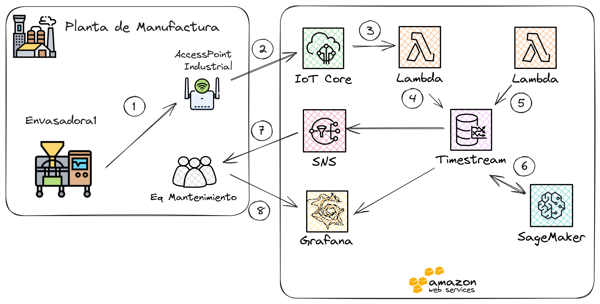
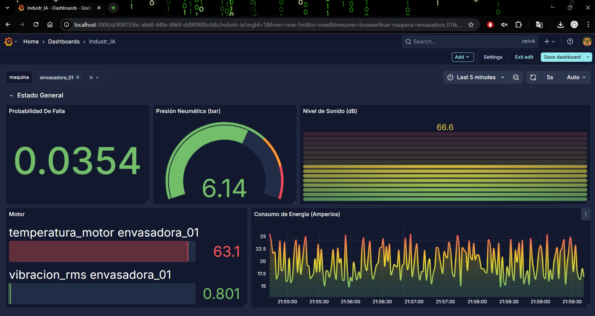
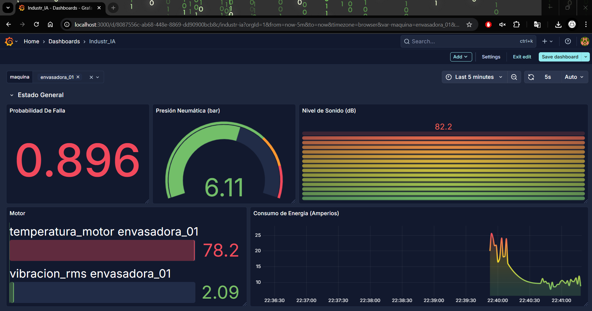

  <h1>Industr_IA: Plataforma de Mantenimiento Predictivo para la Industria 4.0</h1>

Este proyecto presenta <strong>Industr_IA</strong>, una plataforma integral de mantenimiento predictivo diseñada para anticipar fallos en máquinas industriales hasta con tres días de antelación. Utilizando un modelo de Deep Learning (LSTM), la plataforma analiza datos de sensores en tiempo real para minimizar las paradas de producción no planificadas y optimizar las operaciones de mantenimiento.

  

<h2>🤖 Arquitectura del Modelo LSTM</h2>

El núcleo de la plataforma es un modelo de red neuronal recurrente <strong>Long Short-Term Memory (LSTM)</strong> apilado. Esta arquitectura es ideal para analizar secuencias de datos temporales de múltiples sensores, permitiendo aprender patrones complejos que preceden a un fallo. El modelo incluye capas de regularización como Dropout y Batch Normalization para evitar el sobreajuste y mejorar la generalización.

  

<h2>🏗️ Arquitectura de Infraestructura en AWS</h2>

La solución está desplegada en una arquitectura <strong>serverless y orientada a eventos en AWS</strong>, lo que garantiza escalabilidad, flexibilidad y eficiencia en costos.

  

<ol>
  <li><strong>Planta:</strong> Los sensores en la máquina envasadora envían datos a través de un Access Point industrial.</li>
  <li><strong>Ingesta:</strong> AWS IoT Core recibe los datos de forma segura.</li>
  <li><strong>Procesamiento:</strong> Una función Lambda procesa y limpia los datos.</li>
  <li><strong>Almacenamiento:</strong> Los datos se guardan en Amazon Timestream, una base de datos optimizada para series temporales.</li>
  <li><strong>Inferencia:</strong> Otra función Lambda invoca al modelo en SageMaker para obtener una predicción de fallo.</li>
  <li><strong>Modelo:</strong> El modelo LSTM está alojado en Amazon SageMaker.</li>
  <li><strong>Alertas:</strong> Si la probabilidad de fallo es alta, Amazon SNS envía una notificación al equipo de mantenimiento.</li>
  <li><strong>Visualización:</strong> Grafana se conecta a Timestream para mostrar dashboards en tiempo real.</li>
</ol>

<h2>📊 Dashboards de Monitorización en Tiempo Real</h2>

Se desarrollaron dashboards en Grafana para visualizar el estado de la maquinaria y las predicciones del modelo en tiempo real, proporcionando inteligencia accionable al personal de planta.

<h3>Estado Normal</h3>

El dashboard muestra una probabilidad de fallo baja y los valores de los sensores dentro de los rangos operativos normales.

  

<h3>Predicción de Falla</h3>

El sistema detecta una anomalía y la probabilidad de fallo aumenta significativamente, alertando sobre un posible problema inminente.

  

<h3>Máquina Detenida</h3>

Cuando la máquina está parada, los sensores no reportan datos, lo cual se refleja inmediatamente en el dashboard.

  

<h2>🔔 Sistema de Alertas Predictivas</h2>

Cuando el modelo predice una alta probabilidad de fallo, el sistema envía automáticamente una <strong>alerta por correo electrónico</strong> al equipo de mantenimiento. La notificación incluye los valores de los sensores al momento de la alarma para facilitar un diagnóstico rápido.

  

<h2>🎯 Resultados del Modelo</h2>

El modelo predictivo fue evaluado rigurosamente, demostrando una alta efectividad para la detección de fallos:

<ul>
  <li><strong>Precisión Global:</strong> 96% </li>
  <li><strong>Recall (Sensibilidad):</strong> 99% </li>
</ul>

Estos resultados confirman la viabilidad técnica de la solución y su capacidad para minimizar las paradas inesperadas.

